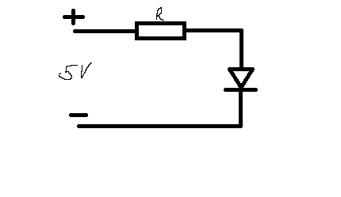

Частина 1 
1. Світлодіод має дуже малий внутрішній опір після відкриття p-n переходу. без резистора діод згорить
2. R=(5-2)/0.02=150 Ом. Побрібний резистор на 220 ом для запасу

4. поставив резистор на 10ом. Сила струму збільшилась до 300мА. Сам діод став дуже яскравим.

Частина 2
Виміряйте фактичний опір 3 різних резисторів мультиметром.
Запишіть номінальне значення та виміряне.
Поясніть, чому вони можуть не збігатися (точність).
Виміряйте пряме падіння напруги на світлодіоді під час роботи при струмі ~20 мА.
Порівняйте виміряне (Vf) із типовим значенням із частини 1.
Виміряйте струм через світлодіод при використанні:
розрахованого резистора
резистора у 2× більшого
резистора у 2× меншого
Зробіть маленьку таблицю з результатами.
Згадайте принципи послідовного і паралельного зʼєднання резисторів.

