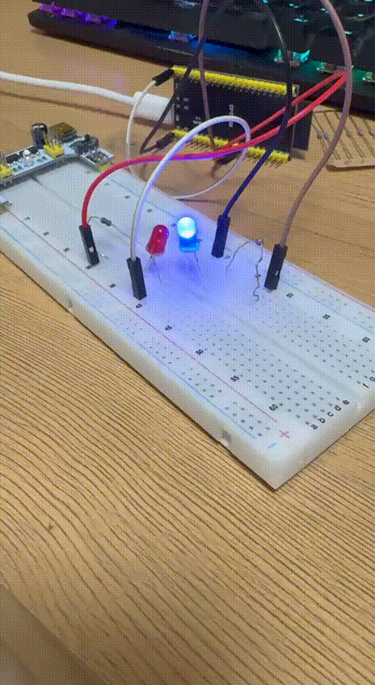

#include <Arduino.h>

#define LED_OUT_B 16
#define LED_OUT_R 17

void setup() {
    pinMode(LED_OUT_B, OUTPUT);
    pinMode(LED_OUT_R, OUTPUT);
}

void loop() {
    digitalWrite(LED_OUT_B, HIGH);
    delay(300); 
    digitalWrite(LED_OUT_B, LOW);
    
    digitalWrite(LED_OUT_R, HIGH);
    delay(300); 
    digitalWrite(LED_OUT_R, LOW);
}

